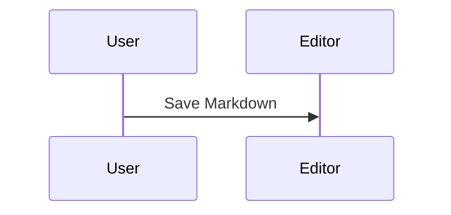

# Mixed Document

Intro with **bold**, *italic*, `code`, math $a+b$, and a footnote[^mixed].

## Checklist

* [x] Rich editing
* [ ] Review diff

## Data

| Item | Result |
| ---- | -----: |
| A    |     10 |

<video controls src="./assets/mixed/result.mp4"></video>

[^mixed]: Mixed syntax remains portable.
